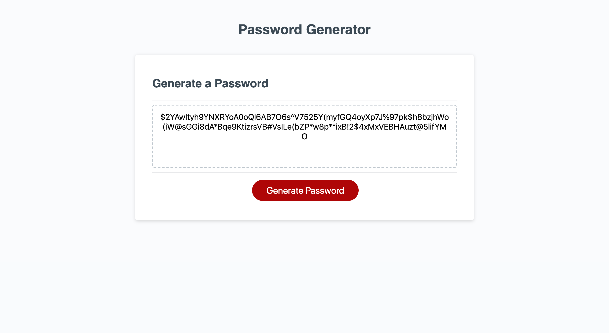

# Password-Generator

https://jbdunks.github.io/Password-Generator

Generates a random password given user supplied criteria. The user clicks the button and is then presented with a series of prompts to select the length and the types of characters to be included in the password. After all the prompts have been the password will be generated in the middle of the page.

